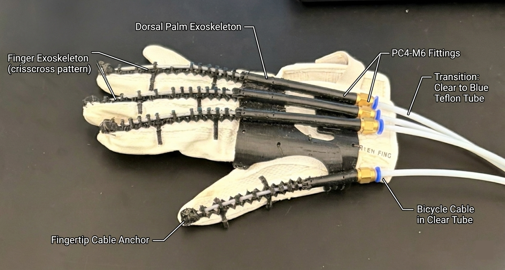
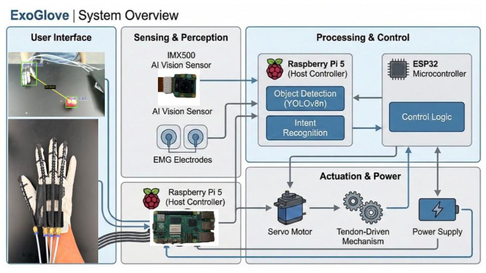
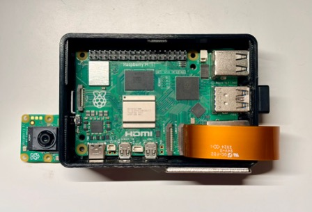
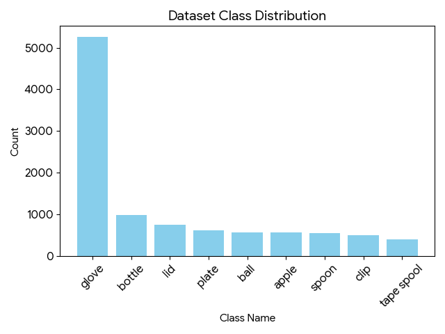
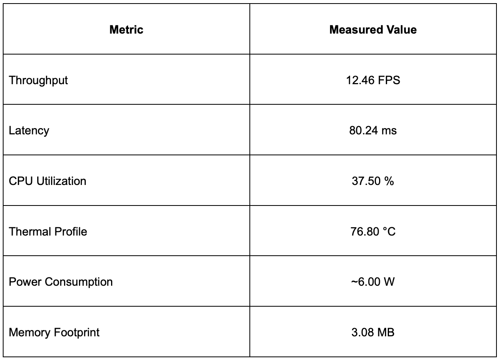
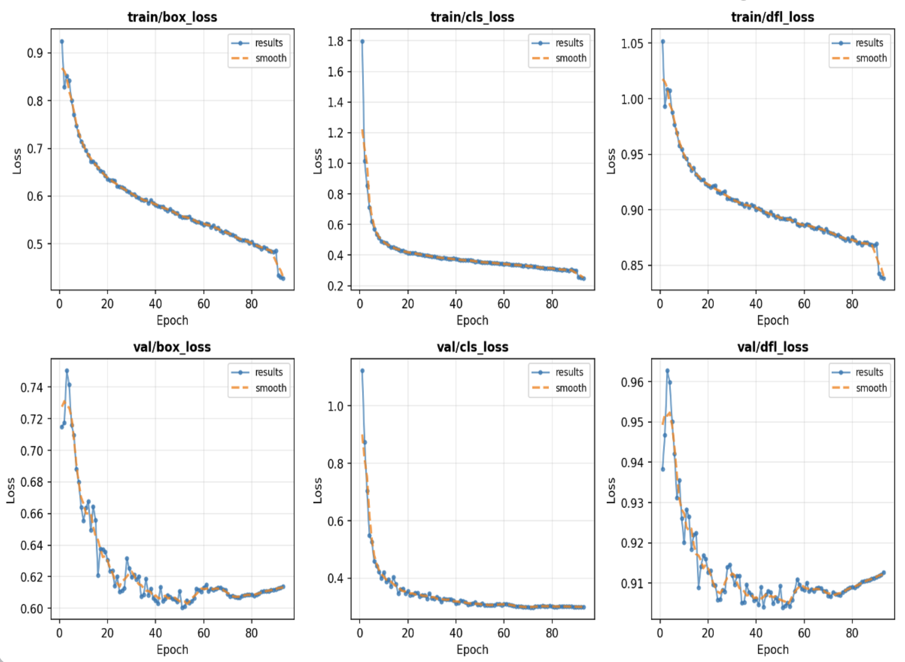
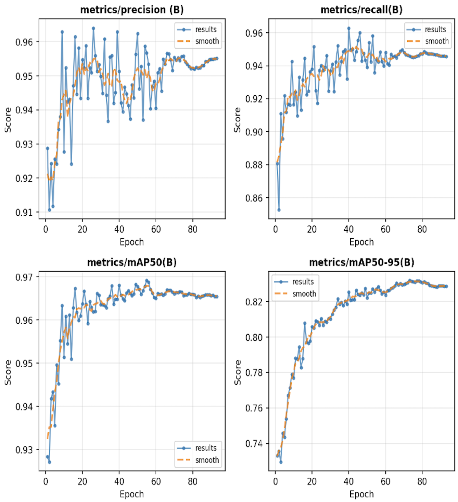
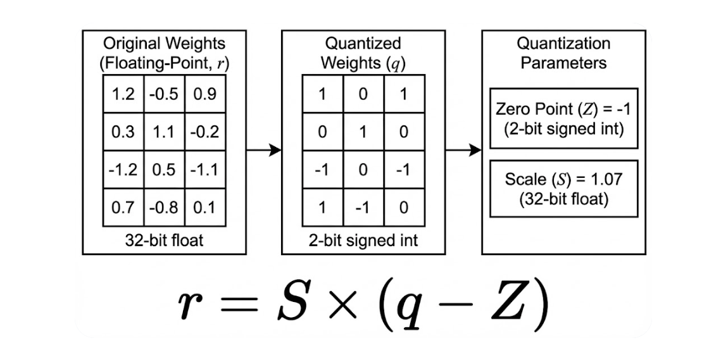
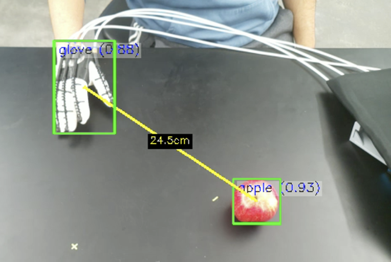
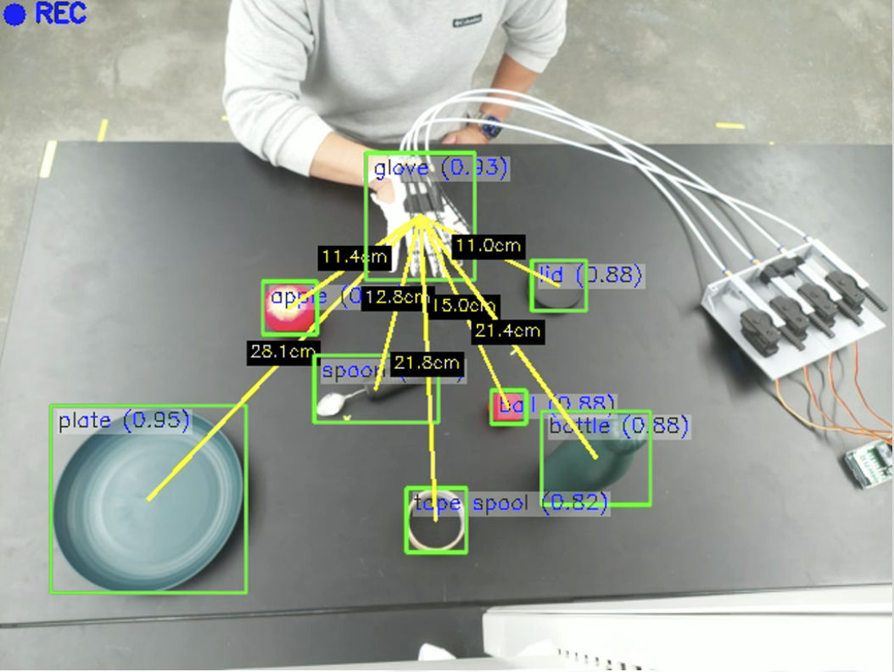

# ExoGlove with Sony IMX500

Real-time embedded vision and sensor fusion for the **ExoGlove**, a soft robotic rehabilitation glove that supports assisted grasping in home or clinical settings.

The system runs a quantized **YOLO11-nano** detector on the **Sony IMX500** intelligent vision sensor (on-sensor INT8 inference), fuses detections with **EMG intent** on an ESP32, and coordinates grasp/release logic on a **Raspberry Pi 5**.

**Author:** Weiping Wu, Department of Electrical and Computer Engineering, San Francisco State University (`wwu@sfsu.edu`)

**Keywords:** ExoGlove, Sony IMX500, YOLO11, quantization, edge AI, rehabilitation robotics, sensor fusion

<p align="center">
  
</p>
<p align="center"><em>ExoGlove soft robotic rehabilitation glove with cable-driven actuation and compact servo mechanism.</em></p>

## Highlights

| Metric | Value |
| --- | --- |
| Model | YOLO11-nano, 9 classes |
| mAP@50 | 96.7% (best checkpoint, epoch 55) |
| Quantized size | 3.08 MB (INT8 on IMX500) |
| Throughput | 12.46 FPS sustained |
| Latency | 80.24 ms end-to-end |
| Host CPU | 37.5% on Raspberry Pi 5 |
| Temperature | 76.8°C steady-state, no throttling |

- On-sensor neural inference: IMX500 outputs detection **metadata only** (boxes, class IDs, confidence)
- INT8 post-training quantization (PTQ) with less than 2% mAP drop vs FP32
- EMG-based intent detection for semi-autonomous grasp / release

**Object classes:** apple, ball, bottle, clip, glove, lid, plate, spoon, tape spool

## System Overview

The ExoGlove integrates:

- **Soft cable-driven actuation** — cables along the fingers, servo on the forearm
- **Sony IMX500 AI camera** — neural inference inside the image sensor
- **Surface EMG** — forearm electrodes for natural user intent

When the user activates relevant muscles and a target object is detected at a reachable distance, the glove assists in closing the fingers around the object.

<p align="center">
  
</p>
<p align="center"><em>System architecture: IMX500 object detection and EMG intent recognition, coordinated by Raspberry Pi 5 and ESP32.</em></p>

<p align="center">
  
</p>
<p align="center"><em>Multi-sensor fusion control framework: camera detections, EMG intent, and application logic produce grasp/release commands.</em></p>

| IMX500 (on-sensor) | Raspberry Pi 5 (host) | ESP32 |
| --- | --- | --- |
| Capture + ISP/DSP pre-process | Configure IMX500 | Sample EMG |
| INT8 inference on built-in NPU | Parse metadata, distance logic | Intent detection |
| Metadata over MIPI / I2C | Grasp/release decisions | Drive servo |

## Sony IMX500

Unlike pipelines that stream full frames to a host GPU/TPU, the IMX500 runs the network on-sensor and returns only metadata. That cuts host load and bandwidth and avoids thermal throttling seen with some edge accelerators under sustained load.

<p align="center">
  
</p>
<p align="center"><em>IMX500 stacked architecture: ISP, DSP, and NPU enable on-sensor INT8 inference.</em></p>

<p align="center">
  
</p>
<p align="center"><em>Raspberry Pi AI Camera (Sony IMX500). Networks are loaded as firmware; metadata is sent to the Pi over MIPI.</em></p>

## Dataset

- **Source:** [Roboflow ExoGlove objects](https://universe.roboflow.com/imx500-muus0/exoglove-ujcr3/dataset/2) (CC BY 4.0)
- **Images:** 11,701 total (10,215 train / 993 val / 493 test)
- **Split:** 70% / 20% / 10%
- **Format:** YOLO annotations; augmentations include flip, color jitter, blur, scale/crop
- **Calibration:** 500-image set for INT8 PTQ activation ranges

<p align="center">
  
</p>
<p align="center"><em>Dataset distribution across nine classes.</em></p>

Download the dataset from Roboflow (YOLO format) and place it so paths in `data.yaml` resolve:

```
train/images, train/labels
valid/images, valid/labels
test/images,  test/labels
```

## Model Performance

<p align="center">
  
</p>
<p align="center"><em>Runtime performance of the quantized YOLO11-nano model on Raspberry Pi 5 + IMX500.</em></p>

### Training

YOLO11-nano is initialized from COCO-pretrained weights and fine-tuned on the ExoGlove dataset (640×640, SGD, cosine LR, best checkpoint at epoch 55).

<p align="center">
  
</p>
<p align="center"><em>Training losses and metrics (precision, recall).</em></p>

<p align="center">
  
</p>
<p align="center"><em>Validation losses and mAP (mAP50, mAP50-95).</em></p>

## Quantization and Deployment

The IMX500 NPU targets **linear INT8** execution. This project uses **post-training quantization (PTQ)** rather than k-means weight clustering or quantization-aware training (QAT).

<p align="center">
  
</p>
<p align="center"><em>Linear quantization: FP weights map to integers via scale and zero-point.</em></p>

<p align="center">
  
</p>
<p align="center"><em>K-means weight quantization compresses storage but typically dequantizes to FP for compute—poor fit for the IMX500 NPU.</em></p>

**Deployed PTQ strategy:**

- Per-channel INT8 weights
- Per-tensor INT16 activations
- Calibration on held-out images

Model size drops from ~6 MB (FP32) to **3.08 MB**, with less than 2% mAP degradation.

<p align="center">
  
</p>
<p align="center"><em>Deployed PTQ strategy for IMX500.</em></p>

<p align="center">
  
</p>
<p align="center"><em>FP32 values mapped to discrete integer levels.</em></p>

QAT can help under aggressive quantization but adds toolchain complexity; PTQ is sufficient here.

<p align="center">
  
</p>
<p align="center"><em>QAT: fake quantization in the forward pass, FP gradients.</em></p>

<p align="center">
  
</p>
<p align="center"><em>Pipeline: train → ONNX → INT8 PTQ → IMX500 package → Raspberry Pi.</em></p>

## Distance Estimation and Control

Monocular distance is estimated from bounding-box height for objects with known size:

$$
d \approx f \cdot \frac{H_{\mathrm{real}}}{H_{\mathrm{pixels}}}
$$

A distance threshold gates grasp assistance so the glove only closes when an object is reachable.

<p align="center">
  
</p>
<p align="center"><em>Distance estimation from camera images via calibrated bounding-box height.</em></p>

**Interaction logic:**

1. EMG flex intent **and** a target within the distance threshold → close glove
2. EMG baseline / release intent → open glove

## Live Demo

<p align="center">
  
</p>
<p align="center"><em>Live demo: IMX500 detections fused with EMG intent to trigger assisted grasping.</em></p>

## Quick Start

### 1. Clone and install (training host)

```bash
git clone https://github.com/wei12f8158/ExoGlove-YOLO11.git
cd ExoGlove-YOLO11

python3 -m venv .venv
source .venv/bin/activate   # Windows: .venv\Scripts\activate
pip install -r requirements.txt
```

### 2. Dataset

Download the [Roboflow ExoGlove dataset](https://universe.roboflow.com/imx500-muus0/exoglove-ujcr3/dataset/2) in YOLO format and extract so `data.yaml` paths exist (`train/`, `valid/`, `test/`).

### 3. Train

```bash
# Option A: Ultralytics CLI
yolo train data=data.yaml model=yolo11n.pt epochs=100 imgsz=640 batch=16

# Option B: project script (auto-selects CUDA / MPS / CPU)
python scripts/training/train_exoglove.py
```

Weights are written under `runs/`. Use the best checkpoint (paper results used epoch 55).

### 4. Export for IMX500 (on Raspberry Pi 5)

Pi setup details: [`DEPLOYMENT_GUIDE.md`](DEPLOYMENT_GUIDE.md) and [`IMX500_DEPLOYMENT_GUIDE.md`](IMX500_DEPLOYMENT_GUIDE.md).

```bash
# On the Pi, with venv active and best.pt available
pip install -r requirements_pi.txt

python3 -c "from ultralytics import YOLO; YOLO('models/best.pt').export(format='imx', imgsz=640, data='data_calib.yaml')"

imx500-package -i models/best_imx_model/packerOut.zip -o final_output
```

A pre-exported package may also be available under `best_imx_model/` depending on your checkout.

### 5. Run detection on Pi + IMX500

```bash
python3 imx500_detection.py --record \
  --model final_output/network.rpk \
  --labels final_output/labels.txt \
  --bbox-normalization \
  --bbox-order xy \
  --threshold 0.5 \
  --pixel-scale 0.1 \
  --serial-port /dev/ttyAMA0 \
  --gpio-sync-pin 18 \
  --cv-rate 5.0
```

Adjust `--serial-port` and GPIO pins for your wiring. Labels for the nine classes are also in `best_imx_model/labels.txt`.

## Project Structure

```
ExoGlove/
├── README.md
├── data.yaml                      # Dataset config (9 classes)
├── requirements.txt               # Training host dependencies
├── requirements_pi.txt            # Raspberry Pi dependencies
├── imx500_detection.py            # Pi + IMX500 runtime (metadata, EMG UART)
├── deploy_and_run.sh
├── DEPLOYMENT_GUIDE.md
├── IMX500_DEPLOYMENT_GUIDE.md
├── pictures/                      # Figures used in this README
├── best_imx_model/                # Example IMX export artifacts / labels
├── scripts/
│   ├── training/                  # train_exoglove.py, train_from_scratch.py
│   ├── deployment/                # Pi helpers and demos
│   ├── export/                    # IMX / ONNX export utilities
│   ├── quick_start.py
│   └── quick_start_pi.py
├── train/ valid/ test/            # Dataset (download separately; gitignored)
└── runs/                          # Training outputs (gitignored)
```

## Hardware

- Raspberry Pi 5 (8 GB recommended)
- Raspberry Pi AI Camera (Sony IMX500)
- ESP32 + surface EMG electrodes + ExoGlove servo hardware
- MicroSD (32 GB+)
- Power supply: **5 V / 5 A** recommended for Pi 5 under load

## Training Configuration (paper)

| Setting | Value |
| --- | --- |
| Model | YOLO11-nano (`yolo11n.pt`) |
| Input | 640×640 |
| Epochs | 100 (deploy best @ 55) |
| Batch | 4–16 (hardware-dependent) |
| Optimizer | SGD, momentum 0.937, lr 0.01 cosine, weight decay 5e-4 |

### Export alternatives

```bash
# IMX format (Pi + IMX500 toolchain)
python3 -c "from ultralytics import YOLO; YOLO('runs/detect/train/weights/best.pt').export(format='imx', imgsz=640, data='data.yaml')"

# ONNX (generic)
python3 -c "from ultralytics import YOLO; YOLO('runs/detect/train/weights/best.pt').export(format='onnx', imgsz=640)"
```

## Limitations and Future Work

- Monocular distance from box size is sensitive to object size and viewpoint
- Nine classes only; more household objects need more data
- Threshold-based EMG does not adapt to user strength, fatigue, or electrode placement
- Informal healthy-subject tests only; clinical validation is future work

**Directions:** depth sensing or learned monocular depth; larger / synthetic datasets and sim-to-real; user-specific EMG models; grasp policies conditioned on object class or fragility.

## Acknowledgment

Thanks to Professor Zhuwei Qin for guidance and feedback, and the Mobile and Intelligent Computing Laboratory at San Francisco State University for resources and support.

## License

The Roboflow ExoGlove dataset is licensed under [CC BY 4.0](https://creativecommons.org/licenses/by/4.0/). See repository files and Roboflow for dataset terms. Add a project license file if you distribute code under a specific license.

## Contributing

1. Fork the repository
2. Create a feature branch
3. Make your changes
4. Open a pull request

## Support

For issues and questions, please open a GitHub issue.
